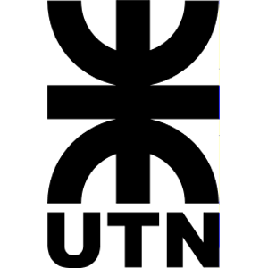

Aplicacion Parcial y Orden Superior
===

 

## Danios en DotA

---

# Como funciona el daño?

El daño se calcula restandole una cantidad de puntos de vida a un personaje. Modelaremos el personaje y como un numero entero que representa su vida. Por ejemplo

```haskell
bane = 660
```

> *Stats de [Bane](https://dota2.gamepedia.com/Bane)*

---

# Sin items

```haskell
danioSinItem ::
    Int -> Int -> Int
danioSinItem cantidad pj =
    pj - cantidad
```

---

# Vanguard

## 

El daño se reduce a la mitad.

```haskell
danioConVanguard ::
     Int -> Int -> Int
danioConVanguard cantidad pj =
    pj - (cantidad `div` 2)
```

---

# Mask of Madness

## 

El daño se duplica!!

```haskell
danioConMaskOfMadness ::
    Int -> Int -> Int
danioConMaskOfMadness cantidad pj =
    pj - (cantidad * 2)
```

---

# Crimson Guard

## 

El Crimson Guard puede estar activo o no.
* Cuando está activo: El daño se reduce en 1
* Cuando no está activo: El item no hace nada


```haskell
danioConCrimsonGuard :: 
    Bool -> Int -> Int -> Int
```

---

# Actividad

Hay un montón de código duplicado.
Quiero tener una forma de que los tests sigan pasando, pero no repetir código, usando los conceptos de [**Orden Superior**](http://wiki.uqbar.org/wiki/articles/orden-superior.html) y [**Aplicación Parcial**](http://wiki.uqbar.org/wiki/articles/aplicacion-parcial.html) que acabamos de ver :smile: